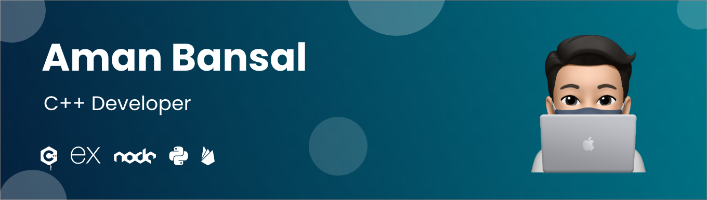

<!-- # Hey, I am Aman -->
<link rel="preconnect" href="https://fonts.gstatic.com">
<link href="https://fonts.googleapis.com/css2?family=Poppins:wght@400;500;600;700&display=swap" rel="stylesheet">

Hey, I am Aman

   I am an experienced C++ Developer working at UTrade Solutions and has experience working on various backend technologies like python flask, experess nodejs and has worked on firebase too.I want to explore all technologies as i don't feel to be constrained by technologies.

<table width="100%">
  <tr>
    <td>
 </td>
 <td>  </td>
  </tr>
 <table>
